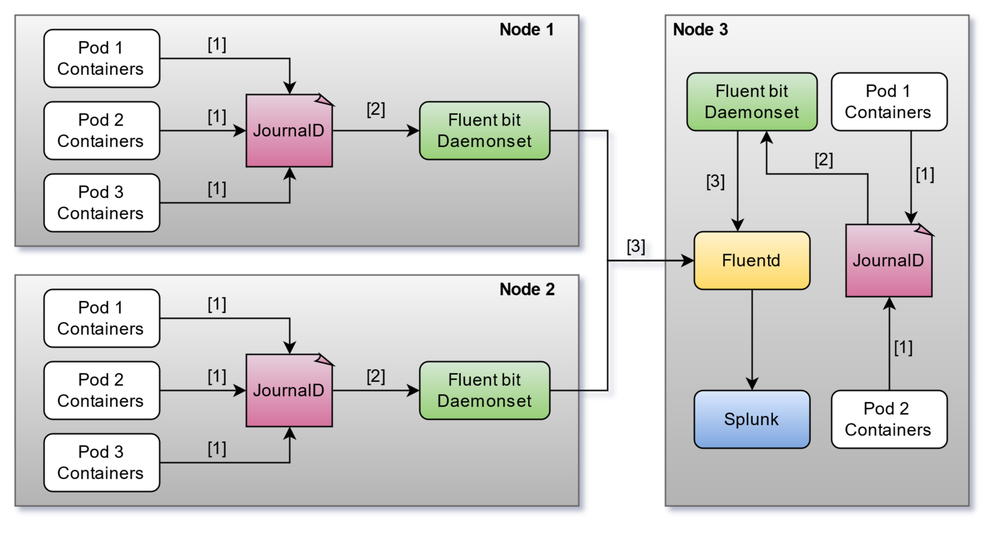

# K8s-Logging-Infra-demo

## Overview
<p align= "center">
<br>
</p>

1. All the application logs which are written onto the standard output stream from all the
   containers in every pod, are routed to the local node’s journald. Journald stores all the
   application logs and the logs generated by the system, in a file. Techniques are log rotation
   have already been implemented by journald and so there is no overflow in the file. The routing of logs
   from application containers to journald can easily be done by specifying **log-driver=journald** in
   **/etc/docker/daemon.json** file. After you changed logging driver, the location of logs has changed to host's journal. 
   So far the logs can be retrieved by docker but you have to let kubelet know about the changes.
   You can do it by passing **--log-dir=/var/log** to kubelet. After adding the flag you have run 
   **systemctl daemon-reload** and restart kubelet. It has to be done on all of the nodes.

2. Each node in the kubernetes environment has a fluent-bit daemonset deployed. This
   daemonset is configured to input logs from journald.
3. The fluent-bit daemontset forwards these logs to fluentd pod. The file **fluentbit/fluent-bit-config.yml**
   shows sample fluent-bit configuration which forwards the structured JSON logs to fluentd
   pod by first parsing it and lifting the JSON fields outwards into parent JSON.
4. FluentD finally forwards logs from all sources to Splunk where the developers can see
   all the logs and perform indexing and searching operations for debugging/monitoring
   purposes
   
## How to run?

1. Deploy the Java application using applicationDeployment.yml file.

``
kubectl apply -f applicationDeployment.yml
``

2. Update fluentd.yml file with your Splunk HEC token, host ip and port. 

3. Deploy the fluend pod using fluentd-config.yml and fluentd.yml files inside the fluentbit folder.

````
kubectl apply -f fluentd-config.yml

kubectl apply -f fluentd.yml
````

4. Get the IP address assigned to fluentd pod by listing the services and 
   update the fluent-bit-config.yml file before deploying it.

````
kubectl get svc
# UPDATE fluent-bit-config.yml with the correct IP
kubectl apply -f fluent-bit-config.yml
kubectl apply -f fluent-bit.yml
````

5. Open your Splunk dashboard to view the logs. 